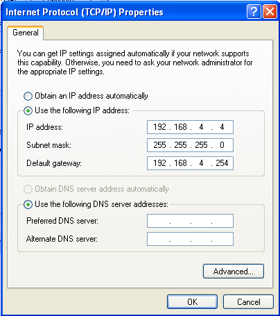
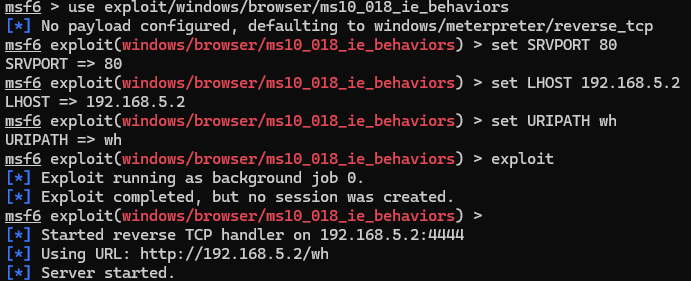
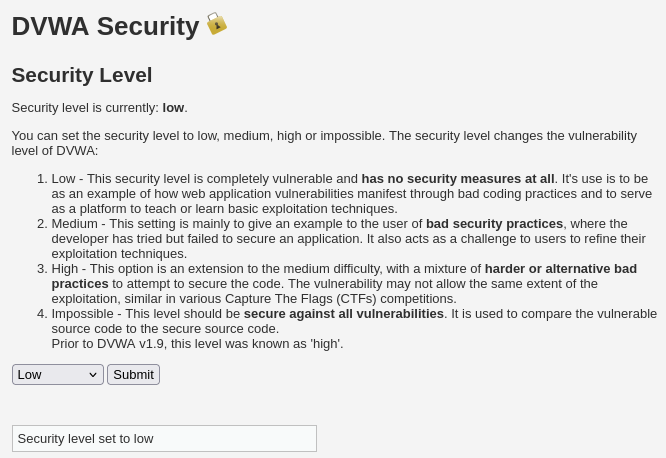
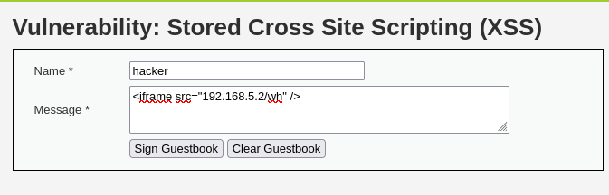
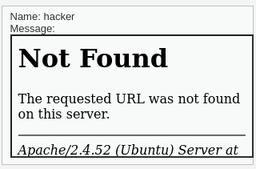
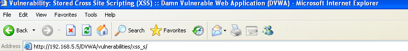
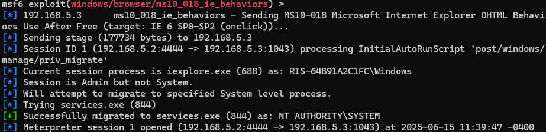

# ACT-NCKU-project
## Red Team Practice

VMs:

1. Kali Linux (attacker)
2. Ubuntu 20.04 (Victim)
3. DVMA (Drive-by Compromise Exploitation)
Tactics & Techniques to exploit:
Tactic	Technique	Description
Initial Access	Drive by Compromise	Watering hole attack by exploiting XSS vulnerability on DVMA, and letting target machine to access the vulnerability
https://www.infosecinstitute.com/resources/application-security/watering-hole-attack-video-walkthrough/ 

### Environment Setup

The environment Setup mostly done by Vagrant+VirtualBox configuration:

- Attacker
  - Distro: Kali Linux
  - IP: 192.168.5.2/24
- DVWA webserver
  - Distro: Ubuntu 22.04 LTS
  - IP: 192.168.5.4/24
- Victim
  - OS: Windows XP SP3
  - Compromising Software: Internet Explorer 6
  - The vagrant network and provisioning don’t worked well here, so I setup all things manually: 
  - IP: 192.168.4.4
- Router (gateway between attacker & victim)
  - IP: 192.168.5.254/24 & 192.168.4.254/24

### Initial Access

On attacker, I set up the exploitation module of the Metasploit Framework:

Then, I exploit DVWA’s XSS (stored) vulnerability:

1. DVWA website security level is set to low:
   
2. Then start the stored XSS attack
   
   
   The script is stored at the webpage, waiting for the victim to access and trigger the watering hole attack.
3. After the victim (Windows XP with IE 6) access the webpage,  
It will redirect the victim to the target website that leverage the vulnerability of IE 6, then send the reverse shell meterpreter payload.
   
Though the browser will be crashed after the exploitation, so for the user might notices some flaws on this website.

### Privilege Escalation

From the attacker side, the XSS attack success and migrates to specified System level process, the Meterpreter session also opened successfully.
