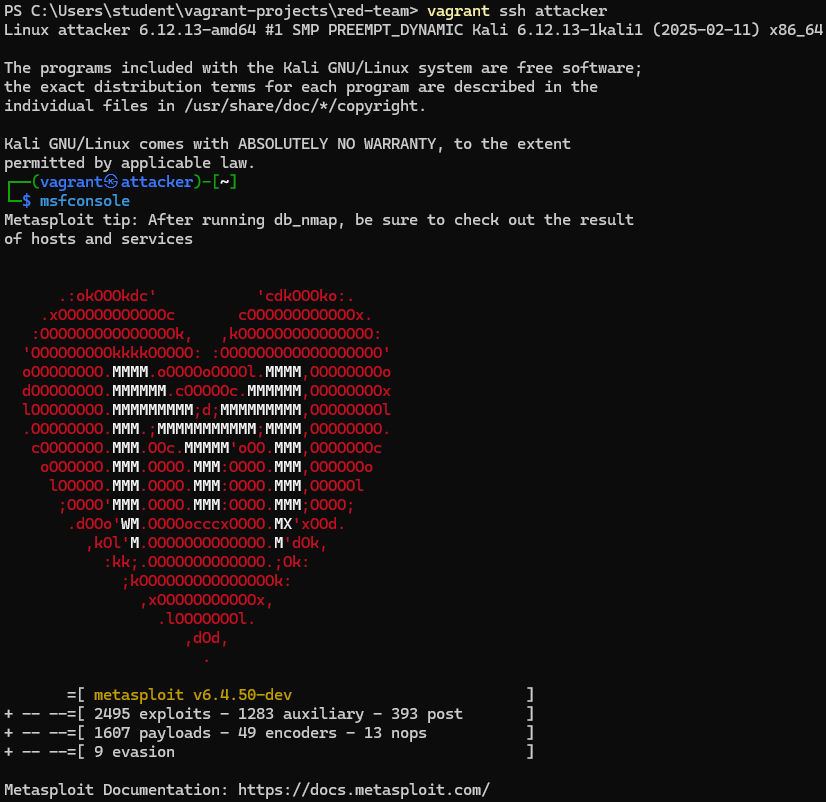

# ACT-NCKU-project

## Prerequisites

- [Vagrant](https://www.vagrantup.com/downloads) (version 2.4.5)
- [VirtualBox](https://www.virtualbox.org/wiki/Downloads) (version 6.1.40) (tested with 7.1.8, but should work with other hypervisors like VMware, Hyper-V, etc.)

## Red Team Practice

### Environment Setup

The environment setup mostly done by Vagrant+VirtualBox configuration:

- Attacker
  - Distro: Kali Linux
  - IP: 192.168.5.2/24
- DVWA webserver
  - Distro: Ubuntu 22.04 LTS
  - IP: 192.168.5.4/24
- Victim
  - OS: Windows XP SP3
  - Compromising Software: Internet Explorer 6
  - The vagrant network and provisioning don’t worked well here, so I setup all things manually:  
    
  - IP: 192.168.4.4
- Router (gateway between attacker & victim)
  - IP: 192.168.5.254/24 & 192.168.4.254/24

### Initial Access

On attacker, I set up the exploitation module of the Metasploit Framework:  
  
  
The module I used is `exploit/windows/browser/ms10_018_ie_behavior`, which is a vulnerability of Internet Explorer 6.  
Below is the description of the vulnerability:

>Description:  
>> This module exploits a use-after-free vulnerability within the DHTML behaviors  
>> functionality of Microsoft Internet Explorer versions 6 and 7. This bug was  
>> discovered being used in-the-wild and was previously known as the "iepeers"  
>> vulnerability. The name comes from Microsoft's suggested workaround to block  
>> access to the iepeers.dll file.  
>>  
>> According to Nico Waisman, "The bug itself is when trying to persist an object  
>> using the setAttribute, which end up calling VariantChangeTypeEx with both the  
>> source and the destination being the same variant. So if you send as a variant  
>> an IDISPATCH the algorithm will try to do a VariantClear of the destination before  
>> using it. This will end up on a call to PlainRelease which deref the reference  
>> and clean the object."  

Then, I exploit DVWA’s XSS (stored) vulnerability:

1. DVWA website security level is set to low:  
     
2. Then start the stored XSS attack  
     
     
   The script is stored at the webpage, waiting for the victim to access and trigger the watering hole attack.  
3. After the victim (Windows XP with IE 6) access the webpage,  
   It will redirect the victim to the target website that leverage the vulnerability of IE 6, then send the reverse shell meterpreter payload.  
   *Problem: the webpage redirection did not success as expect no matter how I try. Since I'm in short of time, I just did the redirection manually...*
     

Though the browser will be crashed after the exploitation, so for the user might notices some flaws on this website.

### Privilege Escalation

From the attacker side, the XSS attack success and migrates to specified System level process, the Meterpreter session also opened successfully.  
